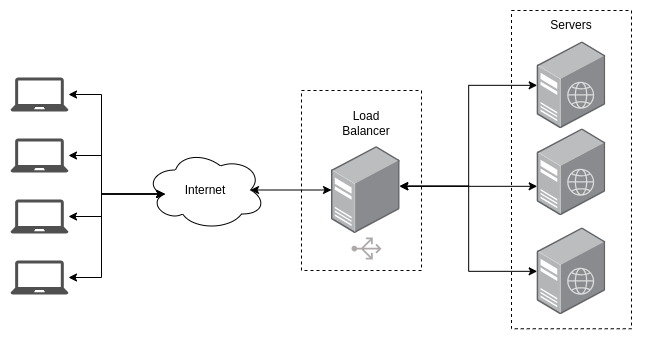

# Load Balancer With Nginx

This is a simple example of a load balancer using Nginx, the load balancer is configured to use the round-robin algorithm to distribute the requests between the servers.

